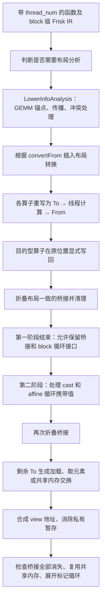

# plan2：从 block tile 到 thread tile，以及 LowerInfo 的作用

本文对应同目录的 [FriskBaseToTheadlevelIR_plan2.cpp](FriskBaseToTheadlevelIR_plan2.cpp)。源码中的新增中文注释说明各函数、重写类和关键计算；本文把它们连接成一条完整流程。这里描述的是当前代码行为，数值算例会明确标注为教学配置。

## 1. 先分清三个对象

| 对象 | 表示什么 | 在代码中的形式 |
| --- | --- | --- |
| block tile | 一个线程块协作处理的逻辑矩阵或切片 | 原始 Frisk op 的 memref，也可能是表示整块数据的 vector |
| thread tile | 当前线程拥有的全部逻辑元素 | 小 vector，或可读写的线程私有 memref |
| MMA 片段 | 一次 warp 级 MMA 指令需要当前线程提供的寄存器元素 | `fragmentA`、`fragmentB`、`fragmentC` |

**完整 thread tile 可以包含多个 MMA 片段。** 它的连续下标不一定对应 block 矩阵里的连续地址：相邻元素可能属于不同的 warp repeat 或 block repeat。

还要区分两种 memref：shared/global memref 表示真实存储；某个由 `FromThreadTile` 产生的 block memref 则可能只是暂时保留原类型的逻辑表示，不能据此认定已经分配、写入一整块物理矩阵。

## 2. 总流程：先建立线程计算，再落实表示边界



图中展示的是需要布局分析的主路径。显式线程切片 `copy_to_reg`、global → shared 搬运以及 shared/global 分配，可以不依赖 GEMM 推导布局。

两个入口分别是：

| 阶段 | 类 / 工厂函数 | 命令行选项 |
| --- | --- | --- |
| 建立线程计算 | `ConvertFriskBaseToThreadLevelIR` / `createConvertFriskBaseToThreadLevelIRPass` | `--convert-friskbase-to-thread` |
| 消除中间表示 | `FinalizeThreadTiling` / `createFinalizeThreadTilingPass` | `--finalize-thread-tiling` |

第一阶段使用 partial conversion：未标记 `tiled` 的目标 Frisk op 必须成功转换；若不支持其布局、形状或使用方式，则 pass 失败。普通控制流及其他不在目标列表里的 op 可以保留。

`isTiled` 检查的是属性**是否存在**，不是布尔属性的值。正常生成的标记为 `tiled=true`。第一阶段再次运行时，如果没有待处理 op，就跳过分析，只做桥接折叠和共享内存复用。

## 3. LowerInfo 是布局说明，不是数据本身

定义见 [LowerInfo.h](../../../include/deepgengraph/Analysis/LowerInfo.h)，推导见 [LowerInfo.cpp](../../Analysis/LowerInfo.cpp)。

`LowerInfoMap` 的键是：

```cpp
std::pair<Value, Operation *>
```

含义是“这个值在这个操作处采用什么布局”。同一 SSA 值在生产者和不同消费者处可能需要不同分布，仅按 Value 查询无法表达全部关系。

### 3.1 与本文件关系最密切的字段

下面所有二维乘法均指逐轴相乘，二维数组轴 0/1 是逻辑矩阵轴，不是 GPU 的 x/y 线程维度。

| 字段 / getter | 含义 | 本文件如何使用 |
| --- | --- | --- |
| `buffer`、`op` | 布局关联的值及操作 | 查找布局；`getAffineMap` 还通过 buffer 获取 context |
| `warp_threads` | 一个 warp 的线程数 | 从整个 block 的 tid 分离 laneId 和 warpId |
| `thread_creg` / `get_thread_widths()` | 一个基础连续分组中，每线程每轴持有的元素数 W | 决定最内层 reg 坐标和线程 tile 形状 |
| `thread_creg_order` | 二维 reg 坐标的展平顺序 | 构造 map 的最后一个实参 |
| `warp_layout` | 一个 warp 内 lane 的二维排布 L | 确定 lane 对应哪个逻辑坐标；计算 shuffle 分组 |
| `warp_layout_order` | laneId 拆成二维的顺序 | 决定哪一轴的 lane 坐标变化最快 |
| `warp_repeat` | 基础 warp 覆盖区域的重复次数 R | 构成一次 MMA 布局的寄存器范围 |
| `warp_repeat_order` | wr 坐标的展平顺序 | 构造 map 的第六个实参 |
| `warpInstUnroll` | 每个 warp 在一次 block 覆盖单元中的指令区域展开数 U | 参与完整 tile 形状、片段数量、地址分解 |
| `block_layout` | 该布局在 block 内的 warp 排布 B | 决定 warp 坐标和一次 block 覆盖范围 |
| `block_layout_order` | warpId 拆成二维的顺序 | 与 laneId 的拆分顺序独立 |
| `block_repeat` | 为覆盖逻辑 tile，需要重复多少个 block 覆盖单元 BR | 决定完整线程 tile 包含多少外层片段 |
| `ignoreDim` | 需要投影掉的逻辑轴，默认 -1 | 归约/广播后固定某轴为 0，或解释一维结果属于哪一轴 |
| `thread_own_data_size` | 分析记录的线程数据量预算 | GEMM C 用它作为完整输出形状；A/B 不能一概照用 |
| `mmaInst` | 绑定的硬件 MMA 指令描述 | GEMM 校验 A/B/C 对应同一指令 |
| `convertFrom` | 当前布局需要从哪种已有布局转换 | 第一阶段据此插入显式 `ConvertLayoutOp` |

基础布局来自硬件 MMA 描述，较外层布局还取决于 tile 形状、线程数和分析传播结果。不能把某组固定的 `warp_layout` 或 `block_layout` 套用到所有 buffer。

### 3.2 分析如何接入本 pass

`LowerInfoAnalysis::run` 先直接推导可作为锚点的 GEMM，再从锚点向前、向后传播布局，反复处理剩余操作，最后调用 `conflictResolve()`。

本文件的 `insertConvertLayoutOps` 将 `convertFrom` 变成真实 IR：在相应消费者前插入转换，只替换该消费者对输入的使用，并在 `convertLayoutInfo` 中保存源、目标布局。

普通 pattern 通过 `findLowerInfoForValue` 查询，顺序是：精确 `(value, consumer)`、该值其他用户、表中相同 buffer，最后从定义该值的 `FromThreadTile` 属性恢复。后面几种是兼容重写后分析键失配的回退，不是新一轮完整布局推断。GEMM 则直接精确查询 A/B/C 的分析信息，因为它还需要 `mmaInst`。

## 4. 第一步：算出完整 thread tile 的形状

`getFullThreadTileType` 对普通、未投影的轴使用：

```text
T[d] = W[d] × R[d] × U[d] × BR[d]
```

`warp_layout` 与 `block_layout` 不直接乘入 T，因为它们描述其他 lane/warp 的分工。当前线程只保存自己负责的元素。

代码还处理以下情况：

- 原始 shape 某轴为 1，线程结果该轴也为 1。
- 二维 `ignoreDim` 轴被压到 1。
- 一维结果且 `ignoreDim=0`，唯一物理轴使用布局轴 1 的尺寸。
- 仅接受静态 rank 1/2；无效大小返回失败。

**为什么不用 `thread_own_data_size` 一步到位？**

分析中 A/B 的旧预算允许在多次 MMA 之间复用寄存器，不包含完整 `block_repeat` 数据；plan2 却在 K 循环外构造完整 A/B SSA vector，再从中提取片段。因此必须重新乘上所有重复次数。GEMM C 要累积并保留全部输出片段，代码使用其 `thread_own_data_size`，同时检查它与 `cCounts * cFragmentShape` 一致。

## 5. 第二步：把线程局部下标映射回 block 坐标

### 5.1 线程内部如何打包

每轴按下面的顺序打包，其中 reg 变化最快：

```text
iv = (((br × U + iu) × R + wr) × W + reg)
```

因此 `buildMappedAccessIndices` 的逆分解是：

```text
br  = iv floordiv (U × R × W)
iu  = (iv floordiv (R × W)) mod U
wr  = (iv mod (R × W)) floordiv W
reg = iv mod W
```

这些都是**一个线程内部**的坐标，还没有包含其他线程的间隔。

### 5.2 LowerInfo map 为什么需要七个参数

`buildLowerInfoMapOperands` 构造：

```text
[tid, br0, br1, iu0, iu1, wr_flat, reg_flat]
```

`br`、`iu` 每轴直接传入；`wr`、`reg` 各自按布局要求展平：

```text
flat(xy, order, shape)
  = xy[order[0]] + xy[order[1]] × shape[order[0]]
```

`order[0]` 是变化最快的轴。`warp_repeat_order` 与 `thread_creg_order` 可以不同，不能始终按普通行优先数组处理。

### 5.3 tid 如何加入地址计算

`LowerInfo::getAffineMap()` 内部先求：

```text
laneId = tid mod warp_threads
warpId = (tid floordiv warp_threads) mod (B[0] × B[1])
laneCoord = 按 warp_layout_order 将 laneId 拆成二维
warpCoord = 按 block_layout_order 将 warpId 拆成二维
```

再定义每轴覆盖宽度：

```text
warpWidth[d]     = W[d] × L[d]
warpInstWidth[d] = warpWidth[d] × R[d]
blockWidth[d]    = warpInstWidth[d] × B[d] × U[d]
```

最终坐标：

```text
blockIndex[d]
  = br[d]        × blockWidth[d]
  + warpCoord[d] × warpInstWidth[d] × U[d]
  + iu[d]        × warpInstWidth[d]
  + wr[d]        × warpWidth[d]
  + laneCoord[d] × W[d]
  + reg[d]
```

这六项分别对应外层重复、warp 位置、指令展开、warp 内区域重复、lane 位置、线程连续元素。

`applyLowerInfoMap` 还处理归约/广播的轴投影。若值是一个 `buffer_view`，上述坐标仍只是 view 内坐标，最后还要通过 `resolveViewAccess` 叠加切片起点，才能访问真实 buffer。

### 5.4 完整数值算例

以下是一组专门用于解释公式的合法覆盖配置，**不声称它是当前硬件分析必然选出的某条 MMA 配置**：

```text
block shape       = [32, 64]
warp_threads      = 64
thread_num        = 128
W                 = [1, 2]
L                 = [8, 8]
R                 = [2, 1]
U                 = [1, 1]
B                 = [1, 2]
BR                = [2, 2]
所有 order         = [0, 1]
ignoreDim         = -1
```

于是：

```text
warpWidth     = [8, 16]
warpInstWidth = [16, 16]
blockWidth    = [16, 32]
thread shape  = W × R × U × BR = [4, 4]
```

这里没有重复持有，128 个线程各持 16 个元素，正好覆盖 `32×64=2048` 个元素。这种数量核对只适用于无复制的分布，不能直接套用到广播或 A/B 跨 warp 复用。

选择 `tid=75`，线程局部位置 `iv=[3,2]`：

```text
laneId=11，warpId=1
laneCoord=[3,1]，warpCoord=[0,1]

轴 0：iv=3，W=1，R=2，U=1
  br=1，iu=0，wr=1，reg=0
轴 1：iv=2，W=2，R=1，U=1
  br=1，iu=0，wr=0，reg=0

map 实参 = [75, 1, 1, 0, 0, 1, 0]
row = 1×16 + 0×16 + 0×16 + 1×8  + 3×1 + 0 = 27
col = 1×32 + 1×16 + 0×16 + 0×16 + 1×2 + 0 = 50
```

所以 `threadTile[3,2]` 表示 `blockTile[27,50]`。

同一线程其他位置如下，可直观看出“局部相邻不总是物理相邻”：

| threadTile 下标 | blockTile 下标 |
| --- | --- |
| `[0,0]` | `[3,18]` |
| `[0,1]` | `[3,19]` |
| `[0,2]` | `[3,50]` |
| `[1,0]` | `[11,18]` |
| `[2,0]` | `[19,18]` |
| `[3,2]` | `[27,50]` |

第二阶段的 `ThreadTileAccess::indices` 使用桥接属性重建同样的计算，不再查询第一阶段的分析表。

## 6. To / From 为什么要显式保留

下面是表示数据流的伪 IR，省略具体类型和属性语法：

```text
原来：
  C_block = frisk.add(A_block, B_block)

第一阶段：
  A_thread = ToThreadTile(A_block, 输入所需布局)
  B_thread = ToThreadTile(B_block, 输入所需布局)
  C_thread = arith.addf(A_thread, B_thread)
  C_block  = FromThreadTile(C_thread, 输出布局)
```

这样每个 pattern 可以独立转换一个 op，而原循环、后续尚未转换的操作仍看到原 block 类型。线程数据关系直接记录在 IR 中，不需要另设跨 pattern 的 Value → Value 表。

`setTileLayout` 在桥接上保存 `tile_layout`、W/R/U、各级 order、warp/block 排布及 `ignore_dim` 等。第一阶段结束后 `s_info` 被清空，第二阶段仍能读这些属性。

对于 `To(From(x))`：

- 布局属性一致、线程类型相同：直接使用 x。
- 布局一致，但 x 是线程 memref、To 要 vector：在 **To 的位置**生成 `vector.load`，保证能看见期间的写入。
- 布局不同：不能仅因 vector shape 相同而抵消，可能需要共享内存交换。
- From 仍有其他 block 用户：只删除已消除的 To，保留 From。

`foldThreadTilePairs` 比较专门列出的布局属性；`ToThreadTileFinalization` 的局部快速路径比较整个属性字典。先运行前者，可以减少非布局属性差异干扰桥接消除的情况。

## 7. 各类算子如何使用 LowerInfo

### 7.1 GEMM：完整 tile → MMA 片段 → 完整结果

`GemmOpTiling` 的关键量是：

```text
fragmentShape = W × R
counts        = BR × U
fullShape     = counts × fragmentShape
```

对 A/B/C 分别计算，按矩阵轴对应检查：

```text
A 的 K 片段数 == B 的 K 片段数
A 的 M 片段数 == C 的 M 片段数
B 的 N 片段数 == C 的 N 片段数
```

随后执行：

```text
A_thread = To(A_block)
B_thread = To(B_block)
C_thread = 全零完整线程 vector

对每个 m 片段：                   // C++ 静态展开
  对每个 n 片段：                 // C++ 静态展开
    c_fragment = affine.for k ... iter_args(acc=零片段):
      a_fragment = 提取 A_thread 的 (m,k) 片段
      b_fragment = 提取 B_thread 的 (k,n) 片段
      next = frisk.warp_mma_rr(a_fragment, b_fragment, acc)
      yield next
    将 c_fragment 插入 C_thread 的 (m,n) 区域

C_block = From(C_thread)
```

`extractGemmTileFragment` 的 A 索引是 `[m*片段行数+row, k*片段列数+col]`，B 索引是 `[k*片段行数+row, n*片段列数+col]`。K 为动态循环变量，因此逐元素 extract/insert，避免依赖静态切片 offset。

这里的 `op.getC()` 是 GEMM 输出，没有输入 C 累加器，每个片段从零开始。`WarpMmaRROp` 接收的是当前线程的片段，由硬件 warp 指令协同执行；本文件并未完成其最终机器指令 lowering。

### 7.2 逐元素计算、广播和 mask

`FriskBinaryOpTiling` 以结果布局为基准处理 add/sub/mul/div。`materializeElementwiseOperand` 先取结果线程需要的输入元素，再处理数值类型和局部广播。

例如一个 `[M,1]` 输入广播到 `[M,N]`：取数时投影单例轴，拿到线程负责的行数据；之后 `broadcastLocalVectorToTile` 在当前线程里重复这些元素。广播本身不负责纠正错误的跨 lane 行归属。

`MaskTileElement` 必须先把线程 iv 映射成 block 坐标，再加 `starts`，最后把坐标传给原 mask region。直接使用线程局部 iv 会改变依赖全局行列关系的 mask 表达式。

`BlockOpTiling` 同样需要分清两类坐标：原 region 参数参与算术时用 block 坐标；线程 memref 的访存使用局部 iv。

### 7.3 归约

`ReduceOpTiling` 先沿当前线程 vector 的归约轴循环，再根据 `warp_layout` 与 order，用 XOR shuffle 合并该轴上的其他 lanes：

```text
laneExtent = warp_layout[归约轴]
laneStride = 归约轴是最快轴 ? 1 : warp_layout[最快轴]
shuffle 偏移 = 1*laneStride, 2*laneStride, 4*laneStride, ...
```

支持浮点 add/mul/min/max，单位元分别为 0、1、正无穷、负无穷。要求归约轴上的 `block_layout` 为 1，相关 lane 数是 2 的幂；当前没有跨 warp 归约实现。

### 7.4 copy 与 copy_to_reg

| 情况 | 处理方式 |
| --- | --- |
| 普通整块 copy | LowerInfo → 源线程 vector → 可选浮点位宽转换 → 目标写回 |
| copy 切片 | 在较大端建立 view；保持 lane/warp 分工，重算切片的 block_repeat |
| global → shared | 独立连续搬运，不使用 MMA 布局；末尾所有线程同步 |
| vector 目标的旧式无结果 copy | 生成新 block SSA 值，只替换被它支配的后续使用，包括 yield |
| 整块 copy_to_reg | 哨兵 map 且源/目标 shape 相同，仍需按 LowerInfo 取得线程数据 |
| 显式偏移 copy_to_reg | 已描述线程连续切片，建立同 shape view，不附完整分布 map |

旧式 `affine_map<() -> (rank)>` 表示整块复制，并不是“偏移 rank 个元素”。

切片 copy 的结果应表示完整目标。若实际复制二维 tile 到四维目标的一部分，最终返回原四维目标；不能把二维切片的布局推广到整个四维张量，也不能丢弃目标未修改的区域。

整块 shared/global copy 的返回值也必须是物理目标的别名，不能替换为源寄存器的快照。
这样，后续消费者从目标按自身布局读取；对目标的后续写入也能通过 copy 返回值观察到。

`ComputedTile` trait（`IR/FriskTraits.h`）明确区分计算值与存储别名：带该 trait
的操作产生独立逻辑值，即使结果类型是 memref，也不要求立即物化到对应内存空间。
GEMM、逐元素算术、数值 cast、zero 和 mask 遵循该约定；view、fill 和 copy 返回值
不属于此类。这个约定独立于 memory effects，不能用 `Pure` 代替别名判断。

`insertConvertLayoutOps` 对“计算值 → 独立 shared allocation”的静态同 shape
整块 copy（整块哨兵或显式全零偏移）直接采用生产者布局写回，保留发布 barrier，
不先转换到消费者的寄存器布局。消费者布局不变，带返回值的 copy 也走同一路径。
该规则依据 trait、形状、地址空间和目标所有权，不识别 attention、P、kernel 名或固定尺寸。
切片、来源存储别名和非独立目标仍采用原有保守路径。物理 shared packing 是后续独立优化。

作为 copy 目标的独立 shared allocation 及其 copy 返回值已经指向物理存储。分析中相邻使用点的线程
布局差异不要求再做 `reg → scratch → reg`：Pass 保留各消费者的布局，直接从该存储
取数。只有 memref 类型但实际表示计算值的结果不会被当作已物化存储；仅由 reduce 等
其他操作写入的临时缓冲区仍交给各自的寄存器转发逻辑处理。

`check_plan2_thread_tiles.py` 覆盖不同尺寸的普通 GEMM → cast → GEMM、返回值别名、
中间写入、全零偏移、外部目标和切片；`check_attention_codegen.py` 继续检查完整链路的
P 元素坐标、发布同步和 LLVM/ISA 导出。前者不执行 GPU，后者的 ISA 检查针对 gfx90a，
均不代表 gfx936 上的性能测量。

## 8. 写回与布局交换

### 8.1 为什么 From 后还要 writeBackBlockTile

fill、copy、reduce、标量 block 等操作具有写目标语义。`FromThreadTile` 仅保留 block 表示，实际副作用由 `writeBackBlockTile` 完成。

| 目标 | 地址 | 同步 |
| --- | --- | --- |
| local / 空间 5 | 线程 memref 的局部 iv | 不生成 block barrier |
| shared | LowerInfo 映射的 block 坐标 | 写后生成 `gpu.barrier` |
| global | LowerInfo 映射的 block 坐标 | 此函数不额外生成 block barrier |

若布局在不同 lanes 或 warps 中复制了同一逻辑值，就不能让所有副本同时写同一物理位置。代码选择 leader：先限制实际写入的 warp 范围，再要求被复制轴上的 lane 坐标和 warp 坐标为零。

shared barrier 放在 leader 分支外，所有线程均可到达。写回也必须保持在原操作位置，不能任意挪到下游消费者之前。

### 8.2 真实布局转换不是 reshape

显式 `ConvertLayoutOpTiling` 的过程是：

```text
源线程寄存器
  → 按源布局写 shared scratch
  → barrier
  → 按目标布局从相同逻辑矩阵读回
  → 再次同步
  → 目标线程寄存器
```

第一次同步保证写完再读；第二次保证共享存储复用前，所有线程读完。源布局的重复元素仍通过 leader 写入。

剩余桥接若形成不同布局的 `To(From(...))`，`ToThreadTileFinalization` 也可从 From 属性恢复源布局，执行类似的共享中转。并非所有未支持的桥接组合都可转换，失败会由最终检查暴露。

## 9. 第二阶段怎样消除剩余桥接

1. `CastFinalization` 将 block 表示上的数值转换移到线程值上。
2. `ThreadTileLoopFinalization` 在受支持的 affine.for 上缩小携带 vector。
3. `foldThreadTilePairs` 消除匹配的表示往返。
4. `ToThreadTileFinalization` 使用 `ThreadTileAccess` 遍历线程 tile，生成真实加载或取元素；若结果是 memref，则写入私有暂存。
5. `BufferViewFinalization` 把切片起点合成进标量访存，保留底层 stride。
6. `FromThreadVectorFinalization` 消除无布局属性、同类型的平凡 From。
7. `ForwardThreadScratch` 消除符合支配关系和唯一写入约束的纯暂存。
8. 检查 To/From/view/cast 是否全部消失，再做共享内存复用和标记循环展开。

循环携带值转换只覆盖当前代码明确检查的情况：yield 来自 From，block/thread 两侧都是不同类型的 vector，循环参数和结果仅被 To 使用。它不是任意控制流的通用签名转换。

`isFullyOverwritten` 还能识别将被全量 vector.store 覆盖的线程 scratch，从而跳过读取目标旧值。它是保守判断，不会自动证明任意标量写入循环都能覆盖全部元素。

最终若仍残留上述中间 op，pass 会报告 `could not finalize thread tile; unsupported layout or use`。因此第一阶段输出允许保留桥接，并不等于任意这样的输出都能通过第二阶段。

## 10. 函数和类的阅读索引

各类的 `matchAndRewrite` 是对应转换的执行入口，成功时替换/删除原操作；具体功能如下。源码就近注释提供进一步说明。

| 函数 / 类 | 功能 |
| --- | --- |
| `isTiled` / `markTiled` | 检查及设置“已处理”属性 |
| `getViewBuffer` / `isGlobalToSharedCopy` | 找底层存储，识别专用搬运路径 |
| `composeAccessIndex` 两个重载 / `resolveViewAccess` | 合成 affine 索引及嵌套 view 地址 |
| `findLowerInfoForValue` | 精确查询、回退查询或从桥接恢复布局副本 |
| `getFullThreadTileType` / `setCopyTileShape` | 计算完整线程形状、调整切片重复次数 |
| `setTileLayout` / `toThreadTile` / `fromThreadTile` | 将布局固化为桥接属性，创建表示边界 |
| `findThreadIdxOp` | 在使用位置生成整个 block 的 `thread_id x` |
| `insertConvertLayoutOps` | 将分析冲突变成显式布局转换 IR |
| `createIndexConstant` / `createSingleDimAffineApply` | 构造常量及单变量索引计算 |
| `modBy` / `floorDivBy` / `addIndexValues` | 地址分层所需基础算术 |
| `flattenXY` / `buildLowerInfoMapOperands` | 按 order 展平并构造七个 map 参数 |
| `applyLowerInfoMap` / `buildMappedAccessIndices` | 从线程局部下标生成 block 内坐标 |
| `VectorTileLoopOptions` / `VectorTileLoopNest::emit` | 配置并递归生成携带 vector 的局部循环 |
| `writeBackBlockTile` | 生成真实写回、leader 筛选和 shared 同步 |
| `BroadcastTileElement::emit` / `broadcastLocalVectorToTile` | 在当前线程内部执行单例轴广播 |
| `eraseTriviallyDeadOps` / `promoteSingleIterationAffineFors` | 清理死操作及单次迭代循环 |
| `convertScalarAttrForElementType` | 转换 fill 的标量常量属性 |
| `castFloatVectorElementType` | 保持形状，进行浮点 vector 元素转换 |
| `materializeElementwiseOperand` | 按需要的布局取输入，再转换类型及广播 |
| `FriskBinaryOpTiling` / `Exp2OpTiling` | 生成线程向量上的逐元素计算 |
| `ZeroOpTiling` / `FillOpTiling` | 分别处理纯零值和具有写目标语义的填充 |
| `AllocBufferOpTiling` | 保留物理 block 分配，缩小 local 分配 |
| `MaskTileElement::emit` / `MaskOpTiling` | 用映射后的逻辑坐标执行 mask region |
| `createReduceIdentity` / `combineReduceValues` | 构造归约单位元及二元合并计算 |
| `ReduceTileElement::emit` / `ReduceOpTiling` | 线程内归约与 warp 内 shuffle |
| `lowerGlobalToSharedCopy` | 按连续区间协同搬运，处理向量宽度和尾部 |
| `CopyOpTiling` | copy 切片、位宽转换、SSA 更新和写回 |
| `isWholeTileCopyToReg` / `CopyToRegOpTiling` | 区分并处理整块取数和显式线程切片 |
| `LayoutReadBackElement::emit` / `ConvertLayoutOpTiling` | 按目标布局回读共享中转矩阵 |
| `BlockOpTiling` | 将受支持的标量 region 映射为线程循环 |
| `extractGemmTileFragment` / `GemmOpTiling` | 从完整线程 tile 提取 MMA 片段并组装结果 |
| `isBlockTileOperation` | 列举本阶段需要改写的 Frisk 操作 |
| `foldThreadTilePairs` | 布局检查后消除桥接，保留必要的加载和用户 |
| `ThreadTileAccess::read` / `indices` | 从属性恢复最终访存所需的分层参数与坐标 |
| `BufferViewFinalization` | 将 view 合并到实际标量访存 |
| `finalizeNumericCast` / `CastFinalization` | 消除数值转换的中间表示 |
| `ThreadTileLoopFinalization` | 收缩受支持 affine 循环的携带 vector |
| `isFullyOverwritten` | 判断 scratch 是否可免读旧值 |
| `ReadThreadTileElement::emit` / `ToThreadTileFinalization` | 物化线程取数及布局交换 |
| `FromThreadVectorFinalization` | 消除无分布变化的同类型 From |
| `ForwardThreadScratch` | 转发可证明只作中转用途的私有暂存 |
| 两个 pass 的 `getDependentDialects` | 声明将生成的 dialect |
| 两个 pass 的 `runOnOperation` | 按前述顺序组织本阶段处理 |
| 两个 `create...Pass` 工厂函数 | 构造 pass 并接入注册/调用接口 |

## 11. 对照 IR 时建议检查什么

- 用 `(buffer, op)` 看 LowerInfo，不要默认整个程序中同名数据只有一种布局。
- 先核对 W/R/U/BR 和 thread shape，再核对 tid 拆分及 order。
- 桥接的输入输出 shape 相同或元素数相同，都不能单独证明布局相同。
- GEMM A/B 要分清完整 tile 和一次 MMA 的最低寄存器预算。
- 检查 view 偏移是在逻辑坐标之后叠加，实际访问仍使用底层 buffer 的 stride。
- 对 fill/copy/reduce 检查真实 store 和同步，不能只看 From 是否存在。
- 归约结果的单例轴要同时检查 shape、ignoreDim、shuffle 分组与 leader 写入。
- 先看第一阶段生成的 To/From 属性，再看第二阶段的真实 load/store，较容易定位索引错误。

项目已有 [check_plan2_thread_tiles.py](../../../test/check_plan2_thread_tiles.py)，覆盖第一阶段的部分 GEMM、广播/归约、copy、循环更新、桥接折叠和重复执行场景。它需要可执行的编译器工具作为参数，其结果不能直接代替第二阶段或 GPU 数值正确性验证。


## 计算结果写入 shared 的生产者/消费者联合布局

`planSharedOperandPacking` 对自有、未逃逸、完整写入的二维 shared buffer 分析所有 producer/consumer。普通 GEMM → cast → GEMM 也走这条路径；不匹配 attention 名称、P 名称或固定 tile 尺寸。

对于 GEMM A 的列轴，若 `ComputedTile` 生产者每个线程持有间隔为 `S` 的列，且消费者的指令 K 跨度为 `K`，在 `N` 可被 `2K` 整除、`K` 可被 `S` 整除、所有使用者布局兼容时，记录 `frisk.shared_store_stride=S` 和 `frisk.shared_store_pair=K`。这两个属性从 `frisk.alloc_buffer` 传播到低层 `memref.alloc`；`PackSharedMemory` 一次性重写该 buffer 的全部已知访问。

令 `r = col floordiv S`、`G = K/S`，物理下标为：

```text
paired = (r floordiv (2G)) * (2G) + (r mod G) * 2 + ((r floordiv G) mod 2)
physical = ((col mod S) * M + row) * (N/S) + paired
```

该排列是双射，不增加 shared 容量、不改变线程拥有的逻辑元素。生产者寄存器可合成连续 store；消费者相隔一个 K 指令跨度的元素可合并读取。未知访问、逃逸、切片、冲突的消费者布局或不可整除形状均保留保守路径。`pack-shared-operands=false` 关闭自动物理布局规划。

展开循环后，`IRDeepOptimize` 在独立步骤中合并 rank-1 shared 标量访问：同一缓冲区的 store 仅在地址差被证明恒定且互不重叠时排序并合并，最宽 128 bit；相邻或反向相邻的 load 先合成两个元素，再尝试合并更宽的向量。常量采样仅用于提出候选地址差，Presburger 空集检查证明它对所有 affine 操作数成立。遇到 barrier、控制流、未知副作用、写入或读取依赖时停止对应的移动，不依赖算子名或 kernel 模板。

此布局减少指令数并不保证所有访问的 bank 冲突都降低。当前 64×32 FP16 中间块的地址模型显示：128-bit 写入无冲突，32-bit 读取为 2 路集中；实际吞吐应结合目标硬件实测。

回归检查：`check_lds_scalar_packets.py` 用 CPU 验证 FP16/FP32/i16/i32 的乱序写入与反向读取，并检查依赖边界；`check_shared_packing.py` 验证不同形状的地址双射、普通双 GEMM 的自动规划及保守回退；`check_attention_codegen.py` 验证完整 kernel 的逻辑坐标、publication barrier、LLVM 15 兼容性及 gfx90a 指令生成。
